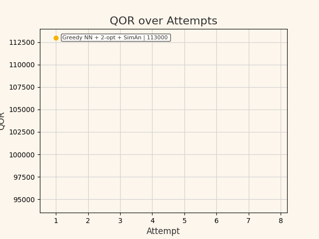

# 🚚 Travelling Salesman Problem with Vehicle Routing (ECE297 M4)

This project solves a variation of the Travelling Salesman Problem (TSP) tailored for a courier company with multiple delivery tasks and depots. The goal is to determine an efficient route that starts and ends at a depot, icks up and drops off packages in a valid order and minimizes the total travel time, considering turn pernalties, node connectivity and other real world constraints.

## 📦 Problem Overview

## ✅ Constraints and Assumptions

- Solution must make all deliveries in valid order (package must be picked up before dropped off)
- A single visit to pickup/dropoff intersection is sufficient for multiple packages
- Route must start and end at any depot
- If no valid route exists, return an empty vector
- Solution must be returned within **50 seconds of wall clock time**
  
## ⚙️  Algorithm Pipeline

## Performance
The timeline of the algorithm's performance on public test cases:

Final Place on Leaderboard: 6th (Public + Private Test Cases)

## Acknowledgement
Shoutout to my teammates Luthira Abeykoon and Grace Hao
